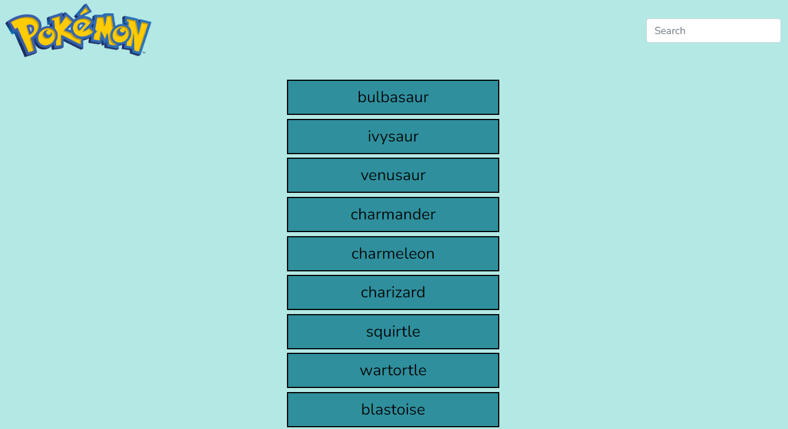

# Pokedex JS App

Pokemon-app displays pokemons fetched from the pokemon Api. When clicked, each pokemon element displays further details about the particular pokemon by use of a modal.

## Demo

[Live Demo Link](https://msemedo2.github.io/Pokedex/)

## Built With

- HTML
- CSS
- Javascript
